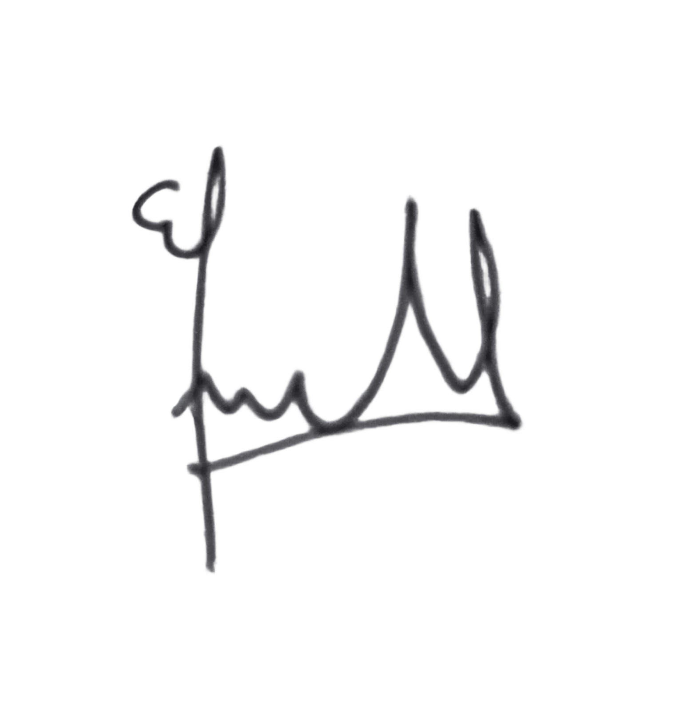
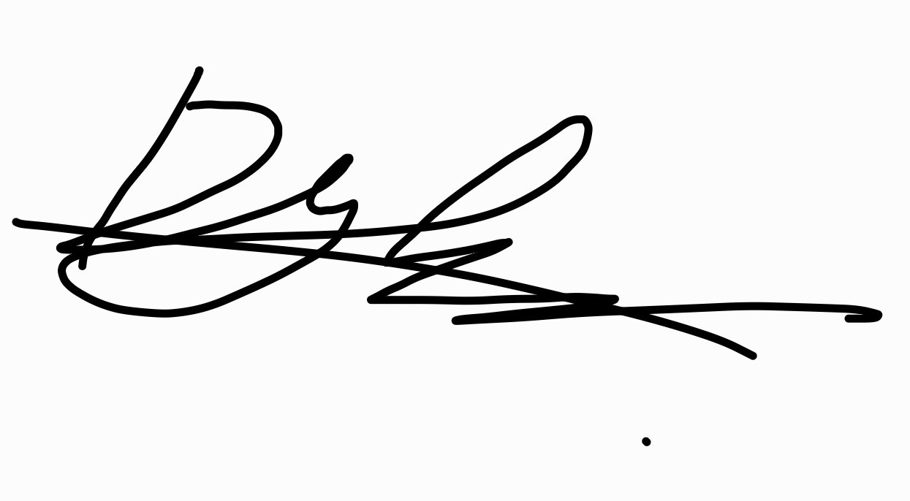
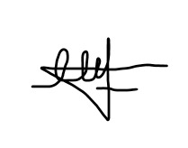
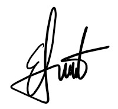
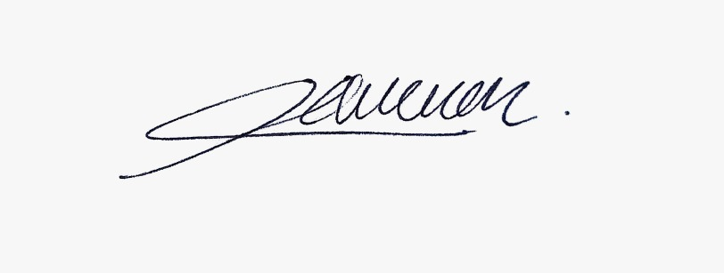

# Deklarasi Penggunaan AI

## Tugas Besar IF2150 - Rekayasa Perangkat Lunak

| Informasi | Keterangan |
|---|---|
| Kelas | *03* |
| Nomor Kelompok | *08* |
| Nama Kelompok | *The Dragon Warrior* |
| Nama Perangkat Lunak | *FoodLink* |

**Anggota Kelompok:**

| NIM | Nama |
|---|---|
| *13525024* | *Excell Timothy Josua Tarigan* |
| *13525036* | *Dylan Frederico Ketaren* |
| *13525111* | *Edbert Fernando* |
| *13525114* | *Ernest Clarence Gunawan* |
| *13525117* | *Abdur Rauuf Fawaaz* |

---

### Daftar Isi
* [Milestone 1](#milestone-1)
* [Milestone 2](#milestone-2)

---

### Log Penggunaan AI per Milestone

Silakan catat penggunaan AI yang berdampak signifikan pada pengerjaan tugas (misal: *generate* fungsi algoritma yang kompleks, *generate* draf dokumen SKPL/DPPL, atau *debugging* error utama). 
*Penggunaan sepele seperti memperbaiki *typo* atau auto-complete satu baris kode tidak perlu dicatat.*

### Milestone 1
| Tool AI | Tujuan Penggunaan | Contoh Prompt Utama | Modifikasi & Validasi Manusia |
| :--- | :--- | :--- | :--- |
| *ChatGPT* | *Memahami terkait asumsi dan batasan* | *"Coba berikan penjelasan terkait asumsi dan batasan saat sedang membuat perangkat lunak"* | *AI menyarankan banyak jenis asumsi dan batasan, namun akhirnya yang dipilih hanya asumsi teknis dan pengguna serta batasan ruang lingkup, resource, dan hukum* |
|*Claude* |*Brainstorming nama perangkat lunak* |*Kami sedang membuat sebuah perangkat lunak sebagai berikut....... Sarankan nama yang cocok* |*Awalnya AI menyarankan nama FoodChain tetapi setelah dipertimbangkan lagi, nama lebih cocok FoodLink karena perangkat lunak yang dibua tidak begitu berhubungan dengan chain (melingkar) dan lebih cocok link (menghubungkan)*|

### Milestone 2
| Tool AI | Tujuan Penggunaan | Contoh Prompt Utama | Modifikasi & Validasi Manusia |
| :--- | :--- | :--- | :--- |
| *Claude* | *Memvalidasi hasil pemetaan kebutuhan (2.3) agar sesuai dengan kriteria* | *Tabel pemetaan kebutuhan, tabel deskripsi aktivitas, kriteria requirement (user, business, system), "Apakah hasil pemetaan kebutuhan ini sudah sesuai dengan kriterianya? Berikan juga rekomendasi untuk revisi jika belum sesuai."* | *AI mengidentifikasi beberapa requirement yang mengandung kata-kata tidak terukur atau ambigu, antara lain R04, R07, R10, R25; kelompok merevisi mengikuti saran dari Claude* |

---
### Pernyataan Integritas dan Persetujuan

Kami yang bertanda tangan di bawah ini menyatakan bahwa seluruh log penggunaan AI di atas adalah benar. Kami telah memvalidasi seluruh hasil AI dan bertanggung jawab penuh atas orisinalitas, keamanan, dan kebenaran hasil akhir dari tugas ini.

| Tanda Tangan | Nama Anggota |
| :---: | :--- |
|  | **13525024 - Excell Timothy Josua Tarigan** |
|  | **13525036 - Dylan Frederico Ketaren** |
|  | **13525111 - Edbert Fernando** |
|  | **13525114 - Ernest Clarence Gunawan** |
|  | **13525117 - Abdur Rauuf Fawaaz** |
