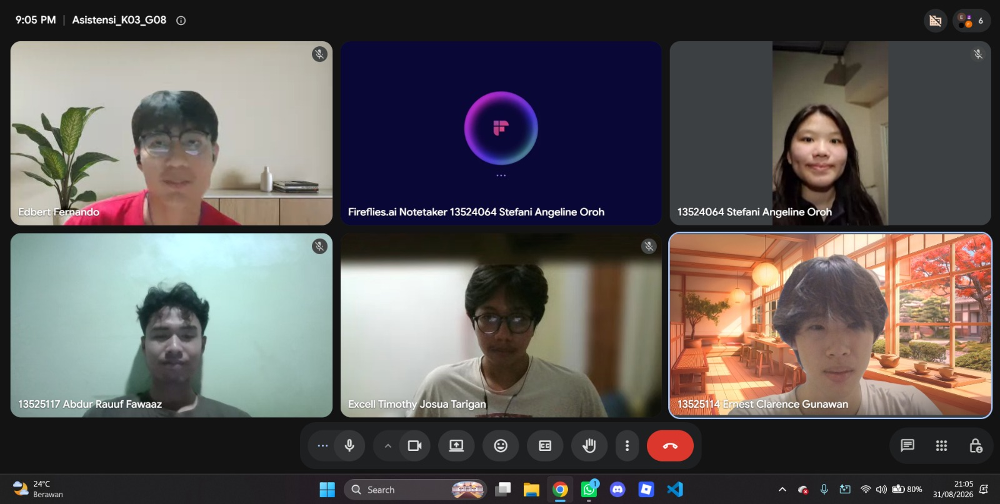

# Form Asistensi

## Tugas Besar IF2150 - Rekayasa Perangkat Lunak

| Informasi | Keterangan |
| --- | --- |
| **Hari** | *Senin* |
| **Tanggal** | *31/08/2026* |
| **Kelas** | *03* |
| **Nomor Kelompok** | *08*  |
| **Nama Kelompok** | *The Dragon Warrior*  |
| **Nama Perangkat Lunak** | *FoodLink*  |
| **Dokumen** | *\[Nama Dokumen yang diasistensikan\]*  |

### Anggota Kelompok

| NIM | Nama |
| --- | --- |
| *13525024* | *Excell Timothy Josua Tarigan* |
| *13525036* | *Dylan Frederico Ketaren* |
| *13525111* | *Edbert Fernando* |
| *13525114* | *Ernest Clarence Gunawan* |
| *13525117* | *Abdur Rauuf Fawaaz* |

### Catatan

| Catatan |
| --- |
| 1. *\[Berikan catatan hasil asistensi\]*  |
| 2. ... |
| 3. ... |
| 4. ... |

**Notes for this section:**  
*Catatan dapat dituliskan dalam bentuk paragraf atau poin-poin, disesuaikan saja.* 

## Dokumentasi

<!--  -->

  

  <i>Gambar 1. Dokumentasi kegiatan asistensi.</i>

